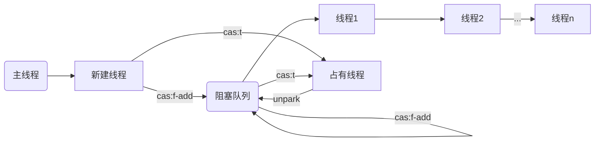

# uqs

> uqs - 轻量的队列同步器

## Metux

互斥队列同步器原理。



### 快速开始

- Logic业务逻辑
    ```java
    class Logic implements Runnable {

        Integer cnt = Integer.valueOf(0);

        public void run() {
            var local = cnt;
            java.util.logging.Logger.getGlobal().info(
                    String.format("thread:%s ts:%d \n want:%d->%d",
                            Thread.currentThread().getName(),
                            System.currentTimeMillis(),
                            cnt, local + 1));
            cnt = ++local;
        }
    }
    ```

    输出：
    ```
    Apr 01, 2023 3:48:46 AM xnuc.example.Logic run
    INFO: thread:Thread-3 ts:1680320926475 
    want:0->1
    Apr 01, 2023 3:48:46 AM xnuc.example.Logic run
    INFO: thread:Thread-9 ts:1680320926476 
    want:0->1
    Apr 01, 2023 3:48:46 AM xnuc.example.Logic run
    INFO: thread:Thread-2 ts:1680320926475 
    want:0->1
    Apr 01, 2023 3:48:46 AM xnuc.example.Logic run
    INFO: thread:Thread-0 ts:1680320926475 
    want:0->1
    Apr 01, 2023 3:48:46 AM xnuc.example.Logic run
    INFO: thread:Thread-8 ts:1680320926476 
    want:0->1
    Apr 01, 2023 3:48:46 AM xnuc.example.Logic run
    INFO: thread:Thread-5 ts:1680320926476 
    want:0->1
    Apr 01, 2023 3:48:46 AM xnuc.example.Logic run
    INFO: thread:Thread-7 ts:1680320926476 
    want:0->1
    Apr 01, 2023 3:48:46 AM xnuc.example.Logic run
    INFO: thread:Thread-4 ts:1680320926476 
    want:0->1
    Apr 01, 2023 3:48:46 AM xnuc.example.Logic run
    INFO: thread:Thread-6 ts:1680320926476 
    want:0->1
    Apr 01, 2023 3:48:46 AM xnuc.example.Logic run
    INFO: thread:Thread-1 ts:1680320926475 
    want:0->1
    Apr 01, 2023 3:48:47 AM xnuc.example.Main main
    INFO: thread:main ts:1680320927477 
    over:1
    ```

- MutexLogic业务逻辑同步器
    ```java
    class MutexLogic extends Logic {

        xnuc.syncer.Mutex mutex = new xnuc.syncer.Mutex();

        @Override
        public void run() {
            mutex.lock();
            super.run();
            mutex.unlock();
        }
    }
    ```

    输出：
    ```
    Apr 01, 2023 3:48:47 AM xnuc.example.Logic run
    INFO: thread:Thread-10 ts:1680320927479 
    want:0->1
    Apr 01, 2023 3:48:47 AM xnuc.example.Logic run
    INFO: thread:Thread-12 ts:1680320927480 
    want:1->2
    Apr 01, 2023 3:48:47 AM xnuc.example.Logic run
    INFO: thread:Thread-11 ts:1680320927480 
    want:2->3
    Apr 01, 2023 3:48:47 AM xnuc.example.Logic run
    INFO: thread:Thread-13 ts:1680320927481 
    want:3->4
    Apr 01, 2023 3:48:47 AM xnuc.example.Logic run
    INFO: thread:Thread-15 ts:1680320927481 
    want:4->5
    Apr 01, 2023 3:48:47 AM xnuc.example.Logic run
    INFO: thread:Thread-14 ts:1680320927482 
    want:5->6
    Apr 01, 2023 3:48:47 AM xnuc.example.Logic run
    INFO: thread:Thread-17 ts:1680320927482 
    want:6->7
    Apr 01, 2023 3:48:47 AM xnuc.example.Logic run
    INFO: thread:Thread-16 ts:1680320927483 
    want:7->8
    Apr 01, 2023 3:48:47 AM xnuc.example.Logic run
    INFO: thread:Thread-18 ts:1680320927484 
    want:8->9
    Apr 01, 2023 3:48:47 AM xnuc.example.Logic run
    INFO: thread:Thread-19 ts:1680320927484 
    want:9->10
    Apr 01, 2023 3:48:48 AM xnuc.example.Main main
    INFO: thread:main ts:1680320928480 
    over:10
    ```