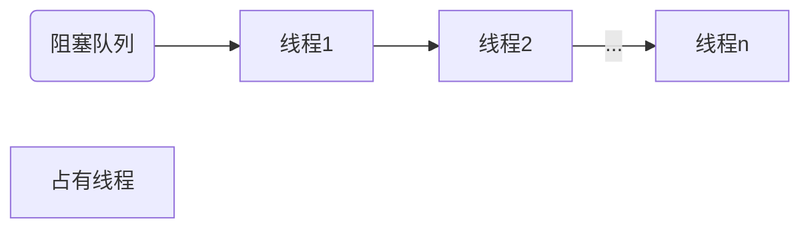
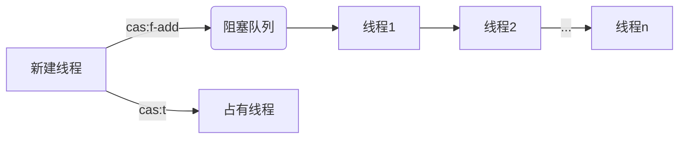
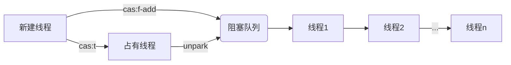
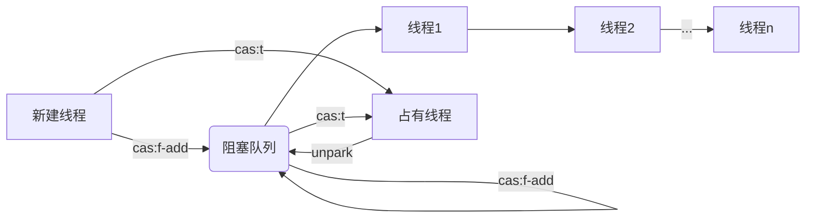

@[TOC](目录)

## 常见问题

> Java有个抽象队列同步器（AQS），AQS是Java并发类的基石，不用AQS如何做线程同步机制呢？

Java如何做线程同步机制呢？


下面是一段业务代码，这段代码可能会被多线程执行，因此其中的计数器变量（cnt），可能会被并发读和改。

```java
class Logic implements Runnable {

    Integer cnt = Integer.valueOf(0);

    public void run() {
        var local = cnt;
        java.util.logging.Logger.getGlobal().info(
                String.format("thread:%s ts:%d \n want:%d->%d",
                        Thread.currentThread().getName(),
                        System.currentTimeMillis(),
                        cnt, local + 1));
        cnt = ++local;
    }
}
```


如果这段代码用于统计代码执行次数，因为缺少多线程同步机制，可能获得错误的结果。

```java
public class Main {
    public static void main(String[] args) throws InterruptedException {
        var logic = new Logic();
        for (int i = 0; i < 10; i++) {
            new Thread(logic).start();
        }
        Thread.sleep(1000);
        java.util.logging.Logger.getGlobal().info(
                String.format("thread:%s ts:%d \n over:%d",
                        Thread.currentThread().getName(),
                        System.currentTimeMillis(),
                        logic.cnt));
}

```

10个线程，每个线程执行一次，预期结果是10，输出结果不及预期，显示只被执行了1次。

```
Apr 01, 2023 3:48:46 AM *.example.Logic run
INFO: thread:Thread-3 ts:1680320926475 
want:0->1
Apr 01, 2023 3:48:46 AM *.example.Logic run
INFO: thread:Thread-9 ts:1680320926476 
want:0->1
Apr 01, 2023 3:48:46 AM *.example.Logic run
INFO: thread:Thread-2 ts:1680320926475 
want:0->1
Apr 01, 2023 3:48:46 AM *.example.Logic run
INFO: thread:Thread-0 ts:1680320926475 
want:0->1
Apr 01, 2023 3:48:46 AM *.example.Logic run
INFO: thread:Thread-8 ts:1680320926476 
want:0->1
Apr 01, 2023 3:48:46 AM *.example.Logic run
INFO: thread:Thread-5 ts:1680320926476 
want:0->1
Apr 01, 2023 3:48:46 AM *.example.Logic run
INFO: thread:Thread-7 ts:1680320926476 
want:0->1
Apr 01, 2023 3:48:46 AM *.example.Logic run
INFO: thread:Thread-4 ts:1680320926476 
want:0->1
Apr 01, 2023 3:48:46 AM *.example.Logic run
INFO: thread:Thread-6 ts:1680320926476 
want:0->1
Apr 01, 2023 3:48:46 AM *.example.Logic run
INFO: thread:Thread-1 ts:1680320926475 
want:0->1
Apr 01, 2023 3:48:47 AM *.example.Main main
INFO: thread:main ts:1680320927477 
over:1
```

为了规避错误的结果，引入线程同步机制，分别介绍三种线程同步机制。

- synchronize
- aqs
- uqs


## synchronized


## aqs


## uqs

接下来，我们来实现一个互斥同步队列。

提炼aqs的原理，抽出来重要的地方去重新实现，非继承而是完完全全的重新实现这一套机制。

uqs提供了一个先进先出的队列，实现为抢占模式，抢占失败的线程重新排队。


使用util下的队列实现阻塞队列，使用util下原子引用实现占有线程。




```java
public class Mutex {

    private java.util.concurrent.atomic.AtomicReference<Thread> state = new java.util.concurrent.atomic.AtomicReference<>();
    private java.util.Queue<Thread> syncer = new java.util.LinkedList<>();
}
```

接下来我们要实现线程阻塞的方法，使用cas操作、入队和park原语。





```java
public class Mutex {

    private java.util.concurrent.atomic.AtomicReference<Thread> state = new java.util.concurrent.atomic.AtomicReference<>();
    private java.util.Queue<Thread> syncer = new java.util.LinkedList<>();

    private synchronized boolean synceradd() {
        return syncer.add(Thread.currentThread());
    }

    public void lock() {
        if (state.compareAndSet(null, Thread.currentThread())) {
            return;
        }
        synceradd();
        java.util.concurrent.locks.LockSupport.park();
    }
}
```



接下来我们要实现线程非阻塞的方法，使用出队和unpark原语，unpark为阻塞队列的第一个线程。

```java
public class Mutex {

    private java.util.concurrent.atomic.AtomicReference<Thread> state = new java.util.concurrent.atomic.AtomicReference<>();
    private java.util.Queue<Thread> syncer = new java.util.LinkedList<>();

    public void unlock() {
        state.set(null);
        var next = syncer.poll();
        if (next == null) {
            return;
        }
        java.util.concurrent.locks.LockSupport.unpark(next);
    }
}
```

此时基本完成了同步器的实现了，此时注意队列的#unlock中的unpark和#lock中的park存在冲突，使用cas解决冲突即可。



```java
public class Mutex {

    private java.util.concurrent.atomic.AtomicReference<Thread> state = new java.util.concurrent.atomic.AtomicReference<>();
    private java.util.Queue<Thread> syncer = new java.util.LinkedList<>();

    private synchronized boolean synceradd() {
        return syncer.add(Thread.currentThread());
    }

    public void lock() {
        if (state.compareAndSet(null, Thread.currentThread())) {
            return;
        }
        synceradd();
        java.util.concurrent.locks.LockSupport.park();
        lock();
    }
}
```

完整版代码如下，还不到30行。

```java
public class Mutex {

    private java.util.concurrent.atomic.AtomicReference<Thread> state = new java.util.concurrent.atomic.AtomicReference<>();
    private java.util.Queue<Thread> syncer = new java.util.LinkedList<>();

    private synchronized boolean synceradd() {
        return syncer.add(Thread.currentThread());
    }

    public void lock() {
        if (state.compareAndSet(null, Thread.currentThread())) {
            return;
        }
        synceradd();
        java.util.concurrent.locks.LockSupport.park();
        lock();
    }

    public void unlock() {
        state.set(null);
        var next = syncer.poll();
        if (next == null) {
            return;
        }
        java.util.concurrent.locks.LockSupport.unpark(next);
    }
}
```

使用互斥同步器装饰下业务逻辑。


```java
public class Main {
    public static void main(String[] args) throws InterruptedException {
        var logic = new MutexLogic();
        for (int i = 0; i < 10; i++) {
            new Thread(logic).start();
        }
        Thread.sleep(1000);
        java.util.logging.Logger.getGlobal().info(
                String.format("thread:%s ts:%d \n over:%d",
                        Thread.currentThread().getName(),
                        System.currentTimeMillis(),
                        logic.cnt));
}

class MutexLogic extends Logic {

    *.syncer.Mutex mutex = new *.syncer.Mutex();

    @Override
    public void run() {
        mutex.lock();
        super.run();
        mutex.unlock();
    }
}
```

大功告成！

```
Apr 01, 2023 3:48:47 AM *.example.Logic run
INFO: thread:Thread-10 ts:1680320927479 
want:0->1
Apr 01, 2023 3:48:47 AM *.example.Logic run
INFO: thread:Thread-12 ts:1680320927480 
want:1->2
Apr 01, 2023 3:48:47 AM *.example.Logic run
INFO: thread:Thread-11 ts:1680320927480 
want:2->3
Apr 01, 2023 3:48:47 AM *.example.Logic run
INFO: thread:Thread-13 ts:1680320927481 
want:3->4
Apr 01, 2023 3:48:47 AM *.example.Logic run
INFO: thread:Thread-15 ts:1680320927481 
want:4->5
Apr 01, 2023 3:48:47 AM *.example.Logic run
INFO: thread:Thread-14 ts:1680320927482 
want:5->6
Apr 01, 2023 3:48:47 AM *.example.Logic run
INFO: thread:Thread-17 ts:1680320927482 
want:6->7
Apr 01, 2023 3:48:47 AM *.example.Logic run
INFO: thread:Thread-16 ts:1680320927483 
want:7->8
Apr 01, 2023 3:48:47 AM *.example.Logic run
INFO: thread:Thread-18 ts:1680320927484 
want:8->9
Apr 01, 2023 3:48:47 AM *.example.Logic run
INFO: thread:Thread-19 ts:1680320927484 
want:9->10
Apr 01, 2023 3:48:48 AM *.example.Main main
INFO: thread:main ts:1680320928480 
over:10
```

